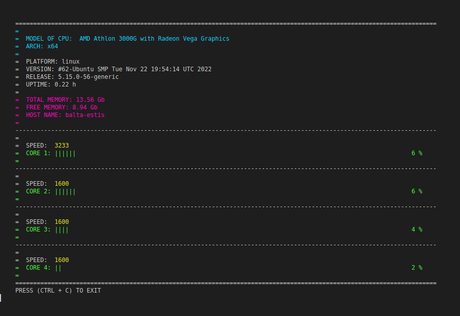

# CPU Watcher

* Monitore o uso de cpu de seu computador

* Veja informações referentes ao Sistema Operacional

* Veja informações referentes ao processador de seu computador

* Veja informações referentes ao uso de memória



## Passos de Instalação

Faça o clone do repositório

```
git clone git@github.com:AnthonyGOliveira/cpu_monitor.git
```

Instale as dependências do projeto

```
npm install
```

## Comandos do Projeto

Para iniciar o projeto, na pasta raiz, execute o comando abaixo em um terminal de linha de comando.

```
npm run start
```
O Comando acima executa o arquivo pricipal do projeto __cpu.js__

Para parar a execução do projeto basta pressionar as teclas sequencialmente __Ctrl + C__
```
Ctrl + C
```
O projeto será finalizado automáticamente.

Para executar os testes do projeto execute o comando:

```
npm run test
```
O resultado dos testes é mostrado no final da execução do comando:
```
--------------------------|---------|----------|---------|---------|-------------------
File                      | % Stmts | % Branch | % Funcs | % Lines | Uncovered Line #s 
--------------------------|---------|----------|---------|---------|-------------------
All files                 |     100 |      100 |     100 |     100 |                   
 converter                |     100 |      100 |     100 |     100 |                   
  bytesToGigabytes.js     |     100 |      100 |     100 |     100 |                   
  secondsToHours.js       |     100 |      100 |     100 |     100 |                   
 utils                    |     100 |      100 |     100 |     100 |                   
  returnPercentOfUsage.js |     100 |      100 |     100 |     100 |                   
  returnTotalIdle.js      |     100 |      100 |     100 |     100 |                   
  returnTotalUsage.js     |     100 |      100 |     100 |     100 |                   
  totalUsageCore.js       |     100 |      100 |     100 |     100 |                   
 view                     |     100 |      100 |     100 |     100 |                   
  colors.js               |     100 |      100 |     100 |     100 |                   
  view.js                 |     100 |      100 |     100 |     100 |                   
--------------------------|---------|----------|---------|---------|-------------------
```
Para verificar os resultados dos testes é possivel abrir o arquivo index.html no browser
```
coverage/lcov-report/index.html
```
## Separação das pastas

| Pasta                             | Arquivo                           | Funcionalidade                |
| ----------------------------------|-----------------------------------|-------------------------------| 
| converter                         |<a href="https://github.com/AnthonyGOliveira/cpu_monitor/blob/main/converter/bytesToGigabytes.js">bytesToGigabytes.js<a>                |Transforma bytes em gigabytes  |
| converter                         |secondsToHours.js                  |Transforma segundos em horas   |
| converage                         |                                   |Arquivos criados na execução do __Jest__  |
| img                               |                                   |Imagens do projeto  |
| template                          |showTemplate.js                    |Gera a visualização das informações na interface  |
| test                              |                                   |Arquivos de testes das funcionalidades do projeto  |
| utils                             |getCpuInformations.js              |Retorna as informações utilizadas no projeto por meio da lib __OS__ de node  |
| utils                             |returnPercentOfUsage.js            |Retorna a porcentagem de uso por núcleo do CPU  |
| utils                             |returnTotalIdle.js                 |Retorna a quantidade total de idle por núcleo do CPU  |
| utils                             |returnTotalUsage.js                |Retorna o resultado da função __totalUsageCore__ executada em cada CPU |
| utils                             |totalUsageCore.js                  |Retorna o resultado total em tempo de uso de núcleo sem idle  |
| view                              |colors.js                          |Atribuição das cores utilizadas no projeto utilizando a lib __chalk__  |
| view                              |view.js                            |Renderiza um log de acordo com a cor selecionada de colors.js|
